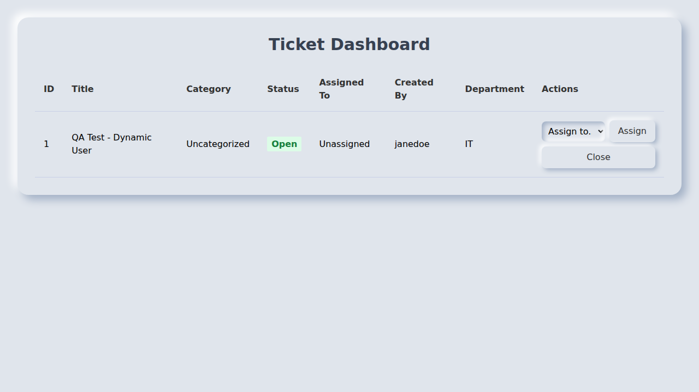
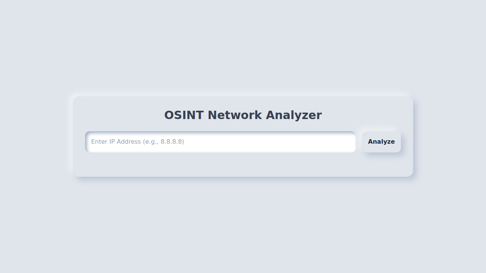
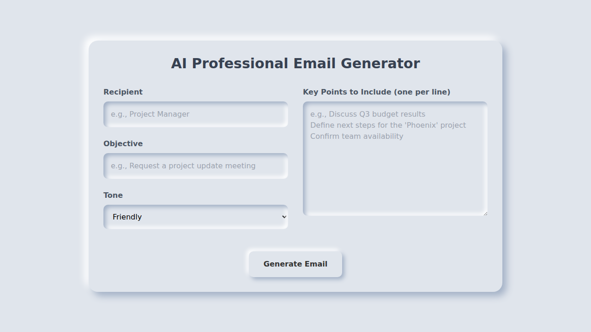
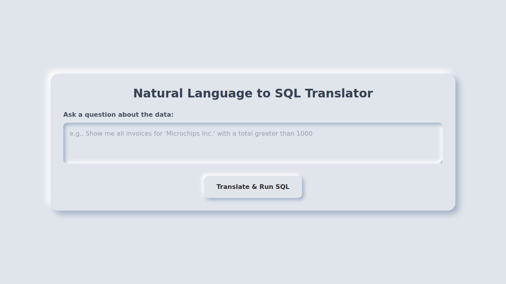
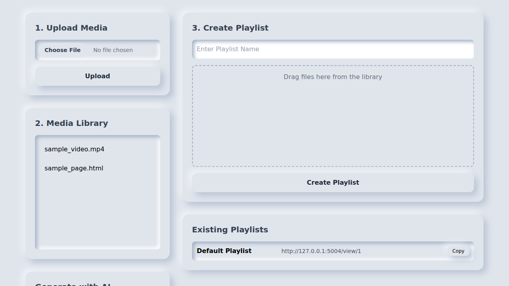
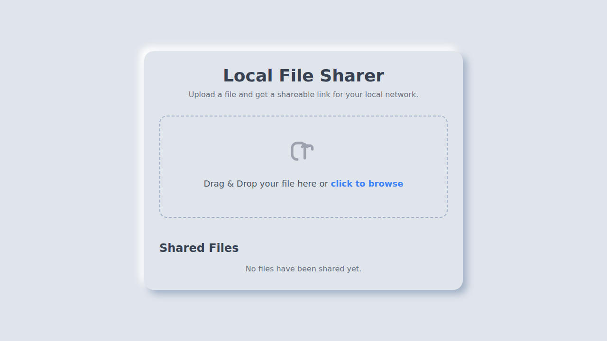
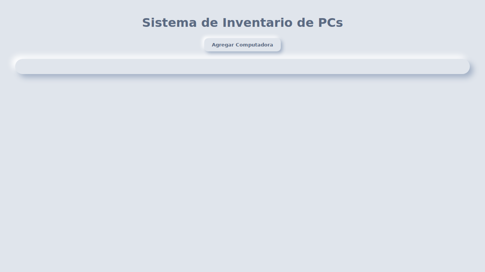

# ⚜️ Suite de Micro-Proyectos ⚜️

¡Bienvenido a esta colección de micro-proyectos! Cada proyecto está diseñado para ser una herramienta funcional, autocontenida y construida con tecnologías modernas.

---

## 📂 Proyectos en esta Colección

| N.º | Proyecto                                             | Estado      |
| :-- | :--------------------------------------------------- | :---------- |
| 1.  | [Sistema FIFO de Tickets para TI](#1-sistema-fifo-de-tickets-para-ti)                      | ✅ Completado |
| 2.  | [Analizador de Red con OSINT e IA](#2-analizador-de-red-con-osint-e-ia) | ✅ Completado |
| 3.  | [Creador de Correos Profesionales con IA](#3-creador-de-correos-profesionales-con-ia)            | ✅ Completado |
| 4.  | [Convertidor de Lenguaje Natural a SQL](#4-convertidor-de-lenguaje-natural-a-sql)                | ✅ Completado |
| 5.  | [Reproductor de Vídeos Minimalista](#5-reproductor-de-v-deos-minimalista)                    | ✅ Completado |
| 6.  | [Compartidor de Archivos en Red Local](#6-compartidor-de-archivos-en-red-local)                 | ✅ Completado |
| 7.  | [Sistema de Micro-Inventario de PCs](#7-sistema-de-micro-inventario-de-pcs)                   | ✅ Completado |
| 8.  | Plataforma de Gestión de Impresoras                  | ⏳ Pendiente  |

---

## 1. Sistema FIFO de Tickets para TI

Este es un sistema de tickets simple y funcional, diseñado para equipos de TI. Permite a los clientes enviar solicitudes y al personal de TI **asignar, gestionar y cerrar** los tickets en una cola **FIFO (First-In, First-Out)**. El sistema cuenta con dos interfaces web distintas y utiliza IA para categorizar automáticamente los tickets.

### ✨ Características Principales

-   **🖥️ Dos Interfaces Web:** Una para clientes y un panel de control para el personal de TI.
-   **➡️ Lógica FIFO:** Los tickets se gestionan en orden de llegada.
-   **🤖 Categorización con IA:** Usa **Ollama** para analizar y categorizar nuevos tickets.
-   **🎨 Diseño Neumorfista:** Interfaz moderna y suave con **Tailwind CSS**.
-   **⚙️ Gestión Completa:** El personal de TI puede asignar y cerrar tickets.
-   **🚀 Instalación Sencilla:** Un script `install.sh` automatiza toda la configuración.

### 🛠️ Stack Tecnológico

---

## 2. Analizador de Red con OSINT e IA

Esta herramienta proporciona un análisis de OSINT (Inteligencia de Fuentes Abiertas) para cualquier dirección IP. Simplemente introduce una IP y la aplicación recopilará datos de geolocalización, información del proveedor de servicios de internet (ISP) y registros WHOIS. Luego, utiliza IA para generar un resumen en lenguaje natural sobre el posible uso o tipo de dispositivo asociado a esa IP.

### ✨ Características Principales

-   **🔍 Análisis OSINT Completo:** Recopila geolocalización, datos del ISP y WHOIS.
-   **🧠 Resumen con IA:** Utiliza **Ollama** para interpretar los datos técnicos.
-   **📊 Interfaz Limpia y Reactiva:** Muestra los resultados de forma organizada.
-   **🎨 Diseño Coherente:** Mantiene el estilo neumorfista con **Tailwind CSS**.

### 🛠️ Stack Tecnológico

---

## 3. Creador de Correos Profesionales con IA

Esta herramienta te ayuda a redactar correos electrónicos profesionales en segundos. Simplemente proporciona el contexto: a quién va dirigido, cuál es el objetivo, el tono deseado y los puntos clave a incluir. La IA se encargará de generar un borrador de correo coherente y bien estructurado, listo para ser copiado y utilizado.

### ✨ Características Principales

-   **✍️ Generación Basada en Contexto:** Define el destinatario, objetivo, tono y puntos clave.
-   **🖱️ Interfaz Intuitiva:** Un formulario claro y conciso para una fácil utilización.
-   **📋 Copia Rápida:** Un botón de "Copiar" permite llevar el texto generado a tu cliente de correo.
-   ** fallback Inteligente:** Si la IA no está disponible, genera un correo de ejemplo.

### 🛠️ Stack Tecnológico

---

## 4. Convertidor de Lenguaje Natural a SQL

Esta herramienta traduce preguntas en lenguaje natural (como *"muéstrame todos los clientes de EE. UU."*) a consultas SQL ejecutables. Interactúa directamente con una base de datos de ejemplo (basada en el esquema de SAP B1) y muestra los resultados en una tabla. Es ideal para usuarios que no conocen la sintaxis de SQL pero necesitan consultar una base de datos.

### ✨ Características Principales

-   **🌐 Interfaz Web Intuitiva:** Un diseño limpio y neumorfista para una fácil interacción.
-   **🤖 Traducción con IA:** Utiliza **Ollama** para convertir el lenguaje natural en consultas SQL.
-   **📊 Visualización de Datos:** Muestra los resultados de la consulta en una tabla dinámica.
-   **⚙️ Contexto de Base de Datos:** Envía el esquema de la base de datos a la IA para obtener consultas más precisas.
-   ** fallback Inteligente:** Si la IA no está disponible, ejecuta una consulta de ejemplo.

### 🛠️ Stack Tecnológico

---

## 5. Reproductor de Vídeos Minimalista

Este proyecto es una solución de señalización digital ligera y fácil de usar. Permite subir contenido multimedia (videos, imágenes, HTML) y organizarlo en listas de reproducción. Cada lista tiene una URL única que puede ser abierta en cualquier navegador para mostrar el contenido en bucle, ideal para cartelería digital, banners o presentaciones.

### 📜 Visión, Misión y Propósito

*   **Visión:** Ser la herramienta de referencia para la señalización digital simple, donde cualquier persona, sin conocimientos técnicos, pueda crear y gestionar contenido visual de forma rápida y autónoma.
*   **Misión:** Proporcionar una plataforma de código abierto que sea minimalista, fácil de instalar y mantener, y lo suficientemente flexible para adaptarse a necesidades básicas de comunicación visual en empresas, eventos o espacios personales.
*   **Propósito:** Democratizar el acceso a la cartelería digital. En lugar de depender de software costoso y complejo, este proyecto busca ofrecer una alternativa gratuita y funcional que empodere a los usuarios para comunicar sus ideas visualmente.

### ✨ Características Principales

-   **🗂️ Panel de Control Centralizado:** Sube y gestiona todos tus archivos multimedia desde un único lugar.
-   **✨ Creación Intuitiva de Playlists:** Arrastra y suelta archivos para crear y ordenar listas de reproducción.
-   **🔗 URLs de Reproducción Únicas:** Cada lista de reproducción genera un enlace público para una fácil visualización.
-   **🤖 Generación de Contenido con IA:** Usa IA para crear páginas HTML simples a partir de texto, que se añaden directamente a tu librería.
-   **🎨 Reproductor Minimalista:** El reproductor público se centra en el contenido, con fondos de colores sólidos (rojo, azul, blanco) para evitar distracciones.
-   **🔄 Reproducción en Bucle:** El contenido de la lista se reproduce de forma continua, ideal para un uso desatendido.

### 🛠️ Stack Tecnológico

---

## 6. Compartidor de Archivos en Red Local

Esta herramienta ultra-ligera convierte tu ordenador en un servidor de archivos local. Está diseñada para compartir archivos pesados de forma rápida y sencilla dentro de una misma red (Wi-Fi), sin necesidad de usar servicios en la nube o memorias USB. Simplemente arrastra un archivo a la interfaz web y obtén un enlace de descarga directo para usar en cualquier otro dispositivo de la red.

### ✨ Características Principales

-   **🚀 Subida Rápida:** Optimizado para la transferencia de archivos grandes en una red local.
-   **✨ Interfaz Intuitiva:** Una única página con una zona de "arrastrar y soltar" para una máxima simplicidad.
-   **🔗 Enlaces Directos:** Genera enlaces de descarga directos y fáciles de copiar.
-   **📊 Barra de Progreso:** Muestra el progreso de la subida en tiempo real.
-   **✅ Cero Dependencias Complejas:** No requiere bases de datos ni servicios externos, solo Flask.

### 🛠️ Stack Tecnológico

---

## 7. Sistema de Micro-Inventario de PCs

Esta es una solución completa para la gestión de activos de TI. Permite llevar un inventario detallado de computadoras, registrar el software instalado, gestionar políticas de uso, y lo más importante, calcular la depreciación de los equipos y generar etiquetas con códigos QR para un fácil seguimiento físico.

### ✨ Características Principales

-   **💻 Gestión de Activos:** Registra computadoras con detalles como número de serie, marca, modelo, fecha y precio de compra.
-   **📊 Cálculo de Depreciación:** Calcula automáticamente el valor contable actual de un equipo usando el método de línea recta.
-   **║█║ Generación de Códigos QR:** Crea una imagen de código QR para cada activo, ideal para imprimir etiquetas de seguimiento.
-   **💿 Inventario de Software:** Lleva un registro del software instalado en cada computadora.
-   **📜 Gestión de Políticas:** Permite documentar y visualizar políticas de uso de los equipos.
-   **🎨 Interfaz Neumorfista:** Una interfaz de usuario moderna y limpia que facilita la gestión.

### 🛠️ Stack Tecnológico

---

*Las secciones para los próximos proyectos se completarán a medida que se desarrollen.*
